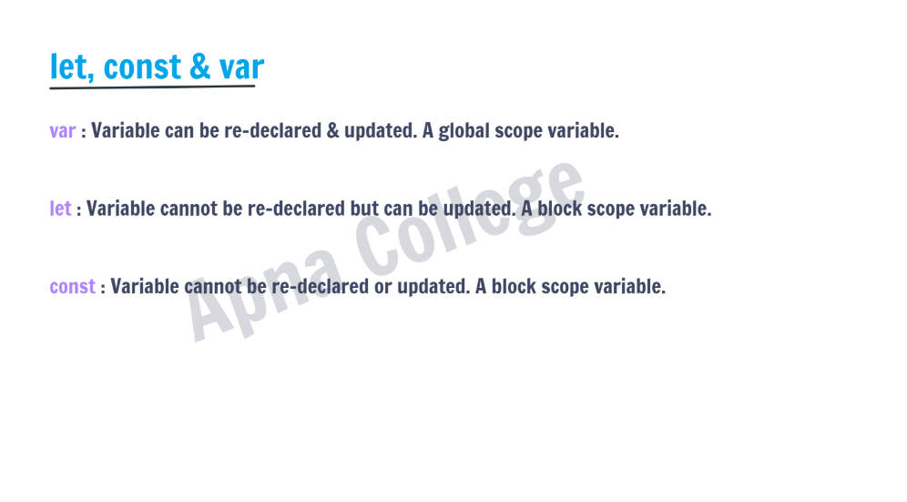
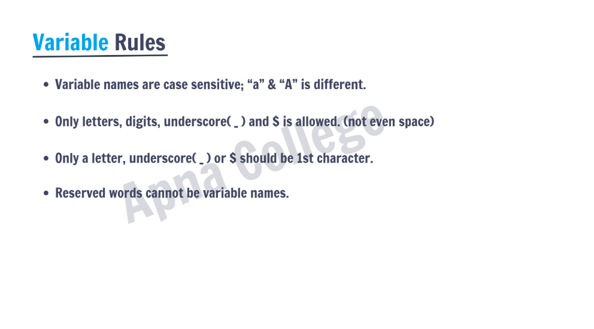

# Javascript Full Docs

## What is Javascript ?

## What are the Rules of variables ?

## What are the Variables in JavaScript ?

    
    Note:
    
    In Const , if we have the Object , so we can change its key value as shown in Object.js file...

## 2. There are various Data Types in Javascript 

    1. Primitive Types : Number, String, Boolean, Undefined, Null, BigInt, Symbol

    2. Non Primitive DataTypes :- Object, Array , Functions

____

## 3. Which are the Various Operators in Javascript ?

    1. Arthemetic Operator:-  + , - , * , /

        a. Modulus                   ----->     %
        b. Exponentiations           ----->     **
        c. Increment                 ----->     a++ , ++a
        d. Decrement                 ----->     a-- , --a

    2. Assignment Operator :- = , += , -= , *= , %= , **=
    
    3. Comparison Operators :- 
        
        a. Equal to                  ----->      ==
        b. Not equal to              ----->      !=
        c. Equal to & type           ----->      ===
        d. Not Equal to & type       ----->      !==

    4. Logical Operators :- 

        a. Logical And               ----->      &&
        b. Logical OR                ----->      ||
        c. Logical NOT               ----->      !

    5. Ternary Operator :- 
        
        Syntax:- 

            condition ? exprIf-True : exprIf-False

            note:- It is the next level if else condition for javascript

    Note :- 

    In Arthemetic a++ is called as post increment . In  this, it prints the value first and then it will perform the operations , So we should write the next console.log for printing the operational value 

    At ++a , it will perform the operation first and then it will print the value in it , it doesnt need to print the another console.log value

    note-2: Check in Arthmetic.js in urinary operator line 

### 4. Rules of Logical Operators table for their specific conditions

            | Cond-1  | Cond-2 |  &&    |  ||   |  
            |:--------|:-------|--------|-------|
            |   T     |   T    |   T    |   T   |
            |   T     |   F    |   F    |   T   |
            |   F     |   T    |   F    |   T   |
            |   F     |   F    |   F    |   F   |

## What is Else if Statement?

Watch the below video for explanations of Else if Statement

<iframe width="560" height="315" src="https://www.youtube.com/embed/q52JXhzDjeQ?si=F3DfHEY33uBy-WNj" title="YouTube video player" frameborder="0" allow="accelerometer; autoplay; clipboard-write; encrypted-media; gyroscope; picture-in-picture; web-share" referrerpolicy="strict-origin-when-cross-origin" allowfullscreen></iframe>

👉 [Watch here to watch this video](https://youtube.com/shorts/ng0Flj2s4oI?si=Vp7xKdsnj3HL8DkY)

___

## What is Loops in Javascript ?

**`Loops are use to execute the piece of code again & again`**

There are different types of Loops in Javascript

1. **`for Loop`**
1. **`while Loop`**
1. **`do-while Loop`**

a. **`for loop`**:-

👉 [Watch here to watch this video](https://youtube.com/shorts/AnaaKhe30gE?si=t1xxlZ6TDfzTpoGb)

## Why don't you use any other alphabets instead of i,j in loops?

le loops to Javascript :-

## What is Clouser?

ChatGPT said:

In JavaScript, a closure is a function that “remembers” the variables from its outer scope even after that scope has finished executing and goes to the garbage.

👉 It allows inner functions to access and use outer function’s variables.

In simple words 

le baburao to parent function :- 

But when there is not written anything in child scope than le to my parent function content

